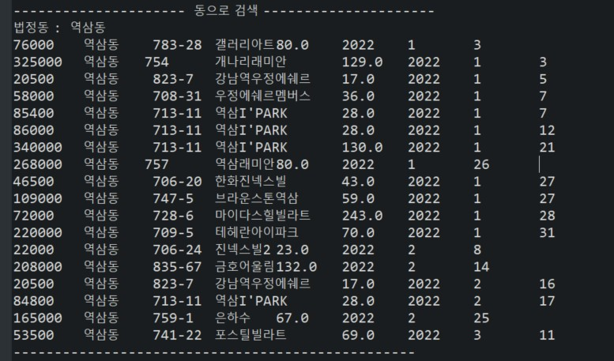
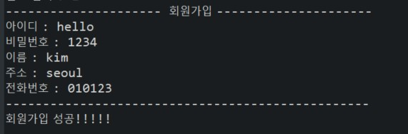
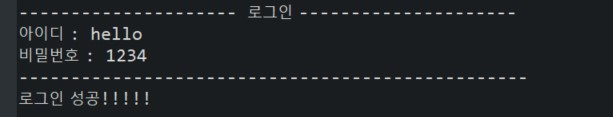
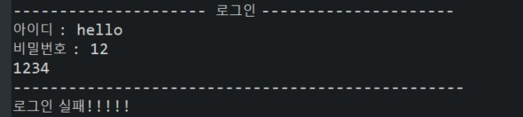
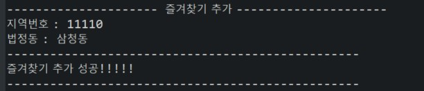
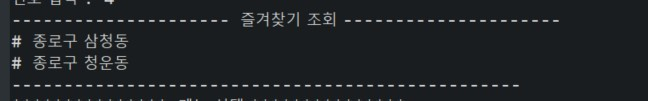
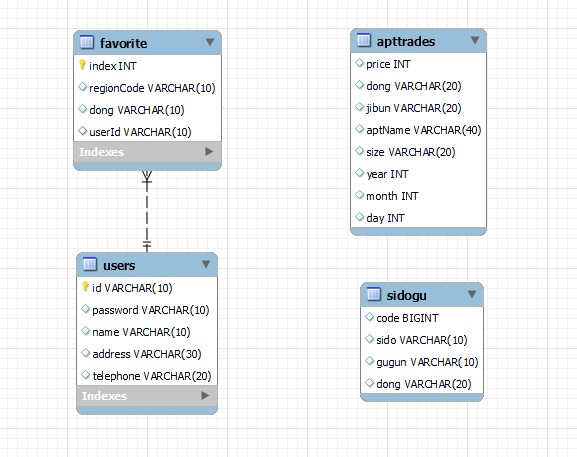

# 장소 CSV -> DB

```sql
use db_test;

create table sidogu(
	`code` bigint,
    sido varchar(10),
    gugun varchar(10),
    dong varchar(20)
);
drop table sidogu;
select * from sidogu;

load data infile 'C:\\ProgramData\\MySQL\\MySQL Server 8.0\\Uploads\\sidogu.csv'
into table sidogu character set euckr
fields terminated by ','
enclosed by '"'
lines terminated by '\r\n'
ignore 1 rows;
```


# 아파트 매매자료 API -> DB

공공API: https://www.data.go.kr/iim/api/selectAPIAcountView.do

2개 지역코드(강남, 송파) 지역의 2022년1,2,3월 자료만 db에 저장하였습니다.

총 6번만 공공 API를 사용하면 되기 때문에 콘솔에 출력후 복사하여 csv파일로 만드는 것이 더 효율적이라 판단하여 그렇게 진행하였습니다.

다음은 Java로 공공API코드에서 해당 월의 모든 거래내역을 출력하는 코드입니다.

```
package aptPrice;

/* Java 1.8 샘플 코드 */


import java.io.InputStreamReader;
import java.io.StringReader;
import java.net.HttpURLConnection;
import java.net.URL;
import java.net.URLEncoder;

import javax.xml.parsers.DocumentBuilder;
import javax.xml.parsers.DocumentBuilderFactory;
import javax.xml.parsers.ParserConfigurationException;

import org.w3c.dom.Document;
import org.w3c.dom.Node;
import org.w3c.dom.NodeList;
import org.xml.sax.InputSource;
import org.xml.sax.SAXException;

import java.io.BufferedReader;
import java.io.IOException;
//11680 강남 1월:56개, 2월: 56개, 3월: 10개
//11710 송파 1월:54개, 2월: 38개, 3월: 11개
public class ApiExplorer {
    public static void main(String[] args) throws IOException, ParserConfigurationException, SAXException {
        StringBuilder urlBuilder = new StringBuilder("http://openapi.molit.go.kr/OpenAPI_ToolInstallPackage/service/rest/RTMSOBJSvc/getRTMSDataSvcAptTradeDev"); /*URL*/
        urlBuilder.append("?" + URLEncoder.encode("serviceKey","UTF-8") + "=ZkmHEAVaoQ0yFwBbRFQSMJkOhXX%2FMQzcTpYDB0Q513dcVb3Vuz6vCU7QSEPdyYs0A3aOUSDG2WuzVo%2BQDF4beQ%3D%3D"); /*Service Key*/
        urlBuilder.append("&" + URLEncoder.encode("pageNo","UTF-8") + "=" + URLEncoder.encode("1", "UTF-8")); /*페이지번호*/
        urlBuilder.append("&" + URLEncoder.encode("numOfRows","UTF-8") + "=" + URLEncoder.encode("60", "UTF-8")); /*한 페이지 결과 수*/
        urlBuilder.append("&" + URLEncoder.encode("LAWD_CD","UTF-8") + "=" + URLEncoder.encode("11710", "UTF-8")); /*지역코드*/
        urlBuilder.append("&" + URLEncoder.encode("DEAL_YMD","UTF-8") + "=" + URLEncoder.encode("202203", "UTF-8")); /*계약월*/
        URL url = new URL(urlBuilder.toString());
        HttpURLConnection conn = (HttpURLConnection) url.openConnection();
        conn.setRequestMethod("GET");
        conn.setRequestProperty("Content-type", "application/json");
        System.out.println("Response code: " + conn.getResponseCode());
        BufferedReader rd;
        if(conn.getResponseCode() >= 200 && conn.getResponseCode() <= 300) {
            rd = new BufferedReader(new InputStreamReader(conn.getInputStream()));
        } else {
            rd = new BufferedReader(new InputStreamReader(conn.getErrorStream()));
        }
        StringBuilder sb = new StringBuilder();
        String line;
        while ((line = rd.readLine()) != null) {
            sb.append(line);
        }
        rd.close();
        conn.disconnect();
//        System.out.println(sb.toString());
        parseResult(sb.toString());
    }
    
    static void parseResult(String result) throws ParserConfigurationException, SAXException, IOException {
    	
    	//파싱객체 생성
    	DocumentBuilderFactory factory = DocumentBuilderFactory.newInstance();
    	DocumentBuilder builder    =  factory.newDocumentBuilder();
    	Document document = builder.parse(new InputSource(new StringReader(result.toString())));
    	
    	//전체 결과수
    	NodeList totalCountNodeList = document.getElementsByTagName("totalCount");
    	String totalCount = totalCountNodeList.item(0).getChildNodes().item(0).getTextContent().trim();
    	int total = Integer.parseInt(totalCount);
    	
    	//아파트정보 파싱
    	for(int i=0; i<total; i++) {
    		getInfos(result, document, i);
    	}
    }
    
    static void getInfos(String result, Document document, int i) throws ParserConfigurationException, SAXException, IOException {
    	
      	NodeList priceNodeList = document.getElementsByTagName("거래금액");
    	String price = priceNodeList.item(i).getChildNodes().item(0).getTextContent().trim();
    	int priceNumber =  Integer.parseInt(price.replaceAll(",",""));
    	
    	NodeList dongNodeList = document.getElementsByTagName("법정동");
    	String dong = dongNodeList.item(i).getChildNodes().item(0).getTextContent().trim();
    	
    	NodeList jibunNodeList = document.getElementsByTagName("지번");
    	String jibun = jibunNodeList.item(i).getChildNodes().item(0).getTextContent().trim();
    	
    	NodeList aptNodeList = document.getElementsByTagName("아파트");
    	String apt = aptNodeList.item(i).getChildNodes().item(0).getTextContent().trim();
    	String aptName = apt.replaceAll(",", "|");
    	
    	NodeList sizeNodeList = document.getElementsByTagName("전용면적");
    	String size = sizeNodeList.item(i).getChildNodes().item(0).getTextContent().trim();
    	
    	NodeList yearNodeList = document.getElementsByTagName("년");
    	String year = yearNodeList.item(i).getChildNodes().item(0).getTextContent().trim();
    	int yearNumber = Integer.parseInt(year);
    	
    	NodeList monthNodeList = document.getElementsByTagName("월");
    	String month = monthNodeList.item(i).getChildNodes().item(0).getTextContent().trim();
    	int monthNumber = Integer.parseInt(month);
    	
    	NodeList dayNodeList = document.getElementsByTagName("일");
    	String day = dayNodeList.item(i).getChildNodes().item(0).getTextContent().trim();
    	int dayNumber = Integer.parseInt(day);
    
    	//todo: sql로...
    	System.out.println(priceNumber+", "+dong+", "+jibun+", "+aptName+", "+size+", "+yearNumber+", "+monthNumber+", "+ dayNumber);
    }
}
```


# 동으로 매매정보 검색하기

콘솔입력창에 "역삼동"으로 검색 -> 역삼동의 1,2,3월 매매가 출력




# 회원가입, 로그인

회원가입하기




가입한 정보로 로그인 시도-> 성공




잘못된 정보로 로그인 시도 -> 실패




# 관심지역 추가, 조회

종로구 삼청동을 관심지역에 추가



관심지역 조회하기




# ERD

